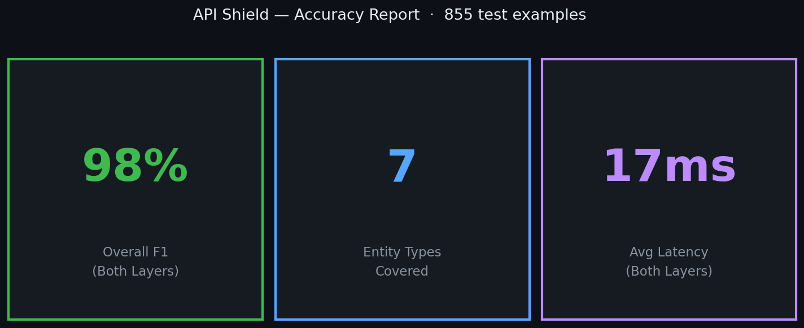
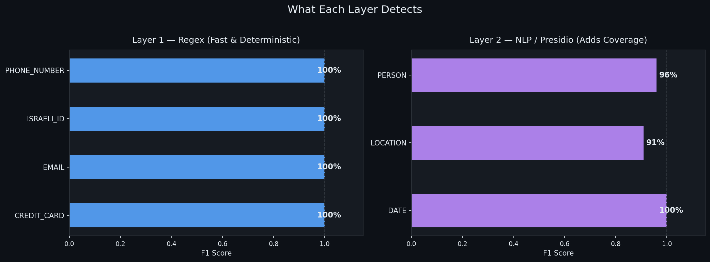
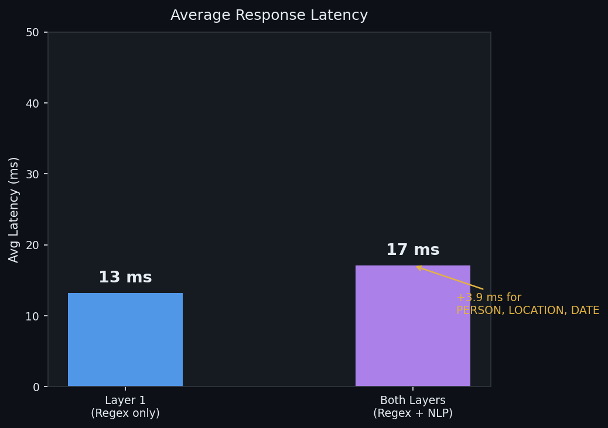

# Accuracy Evaluation

End-to-end accuracy test for API Shield's two-layer PII detection pipeline.

**Overall Macro F1: 0.981 - Average latency: 17ms (both layers)**

---

## Dataset

855 synthetic examples across five categories: single entity, multi-entity, edge cases (no spaces, mixed punctuation), Hebrew-style prefixes, and negative examples (no PII) used for false positive counting.

---

## Charts







---

## Per-entity breakdown

| Entity Type | Layer | Precision | Recall | F1 |
|---|---|---|---|---|
| ISRAELI_ID | 1 | 1.00 | 1.00 | 1.00 |
| CREDIT_CARD | 1 | 1.00 | 1.00 | 1.00 |
| EMAIL | 1 | 1.00 | 1.00 | 1.00 |
| PHONE_NUMBER | 1 | 1.00 | 1.00 | 1.00 |
| PERSON | 2 | 1.00 | 0.92 | 0.96 |
| LOCATION | 2 | 1.00 | 0.83 | 0.91 |
| DATE | 2 | 1.00 | 1.00 | 1.00 |

Layer 1 (regex) is deterministic - zero false positives by design. Layer 2 (NLP/spaCy) adds coverage for unstructured entities; recall below 1.0 reflects cases where the model lacked sufficient context to identify the entity.

Entity values are generated using [Faker](https://faker.readthedocs.io/) with custom generators for Israeli-specific formats: national IDs (Luhn-validated 9-digit), phone numbers (Israeli prefixes: 050/052/054/+972), and credit cards (Luhn-valid). Names, cities, emails, and dates are Faker-generated. Templates cover structured sentences, edge cases with missing spaces and punctuation, and Hebrew-style word-entity concatenation.

---

## Reproduce

```bash
pip install faker requests
python generate.py   # generates dataset.json
python evaluate.py   # requires API Shield running on localhost:8080
python visualize.py  # generates charts in results/charts/
```

Start the service before running evaluate:

```bash
docker-compose up -d
```
